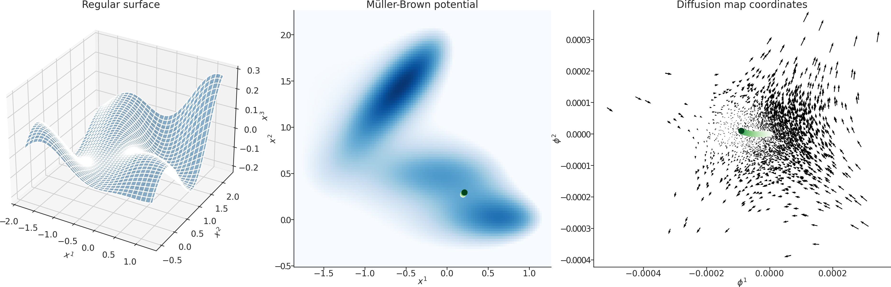

# Source code for Gentlest Ascent Dynamics on manifolds defined by adaptively sampled point-clouds



## Introduction

This is the source code accompanying the paper <a href="https://arxiv.org/abs/2302.04426">J. M. Bello-Rivas, A. Georgiou, H. Vandecasteele, and I. G. Kevrekidis, <i>Gentlest Ascent Dynamics on Manifolds Defined by Adaptively Sampled Point-Clouds,</i> arXiv:2302.04426 (2023).</a>

## Installation

```sh
pip install .
```

## Running the examples

### Simple potential on a sphere

```sh
python examples/simple_sphere.py
```

### Müller-Brown potential on a regular surface

```sh
python examples/muller_brown_regular_surface.py
```
